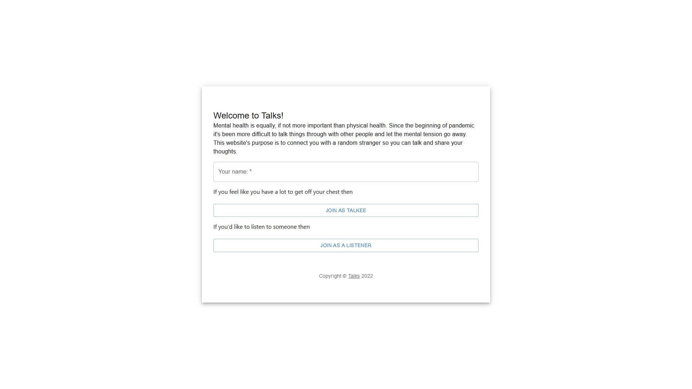
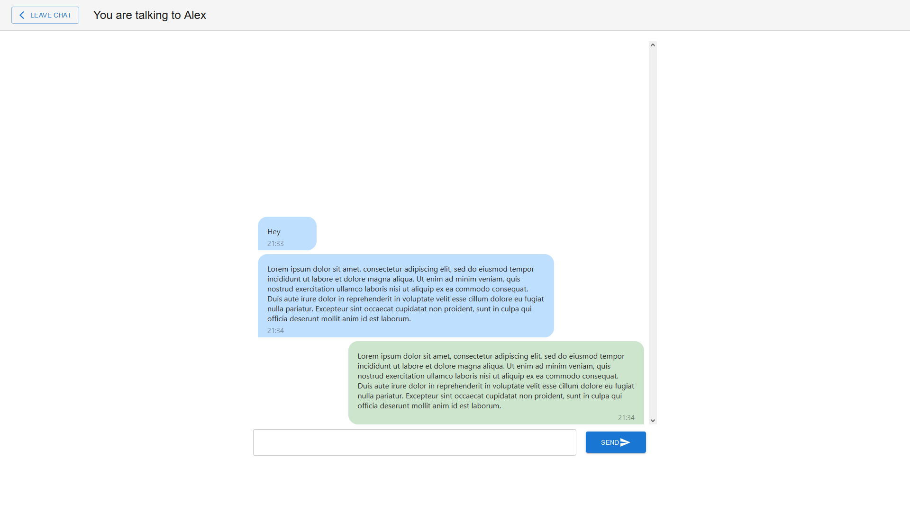

  <h1>Talks - online chat app</h1>
  

    Talks is basic chat application connecting you with other enqueued person online. I've chosen React Js as a framework to use together with Material UI for  majority of style.
  

  

    The app is published on heroku, you can find and try it out on this link -> <a href="http://my-talks.herokuapp.com/" target="blank">my-talks.herokuapp.com</a>.
  

  <h1>Screenshots</h1>
  <h3>Homescreen</h3>
     
  <h3>Chat window</h3>
   

